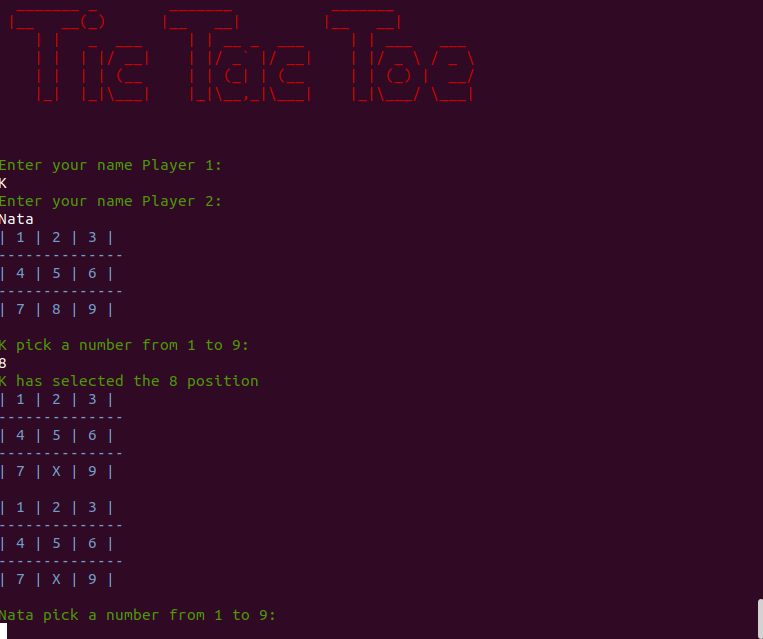

# Tic Tac Toe

> A command line game built in ruby

Additional description about the project and its features.

## Built With

- Ruby
- Rubocop
- Technologies used

## Live Demo

[Live Demo Link](https://livedemo.com)

## Getting Started

**This is an example of how you may give instructions on setting up your project locally.**
**Modify this file to match your project, remove sections that don't apply. For example: delete the testing section if the currect project doesn't require testing.**

To get a local copy up and running follow these simple example steps.

### Prerequisites

### Setup

### Install

### Usage

### Run tests

### Deployment

## Authors

👤 **Natalia Macias** 

- Github: [@NataJenkins](https://github.com/NataJenkins)
- Twitter: [@NataJenkins](https://twitter.com/NataJenkins)
- Linkedin: [linkedin Profile](https://www.linkedin.com/in/natalia-macias-a11a20187/)

👤 **K**

- GitHub: [@harshdeepkanhai](https://github.com/harshdeepkanhai)
- Twitter: [@harshdeepkanhai](https://twitter.com/harshdeepkanhai)
- LinkedIn: [LinkedIn](https://linkedin.com/in/harshdeepkanhai)

## 🤝 Contributing

Contributions, issues, and feature requests are welcome!

Feel free to check the [issues page](issues/).

## Show your support

Give a ⭐️ if you like this project!

## Acknowledgments

- The Odin Project[https://www.theodinproject.com/courses/ruby-programming/lessons/tic-tac-toe]

## 📝 License

This project is [MIT](lic.url) licensed.